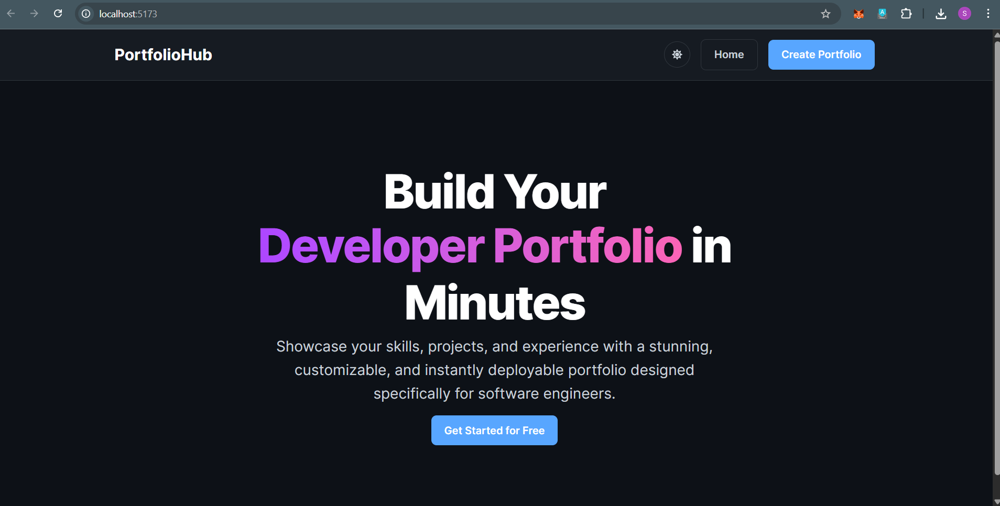
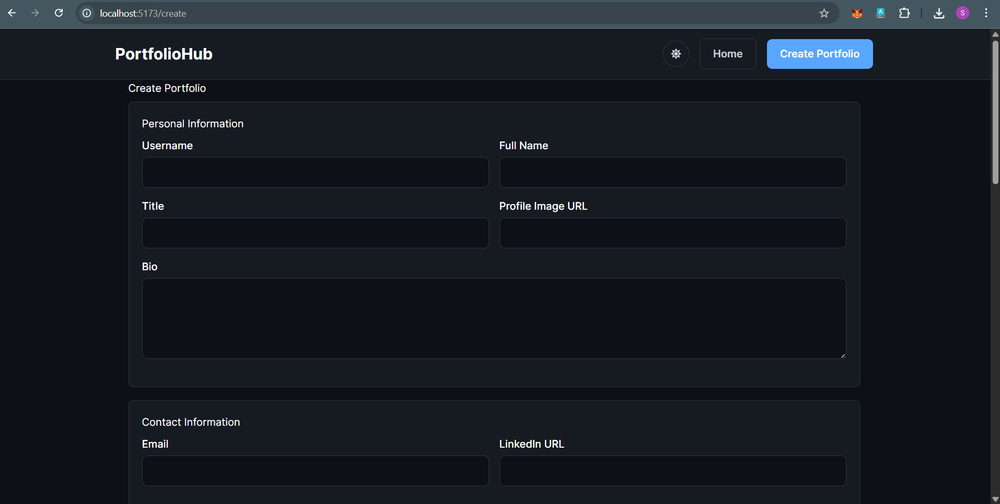
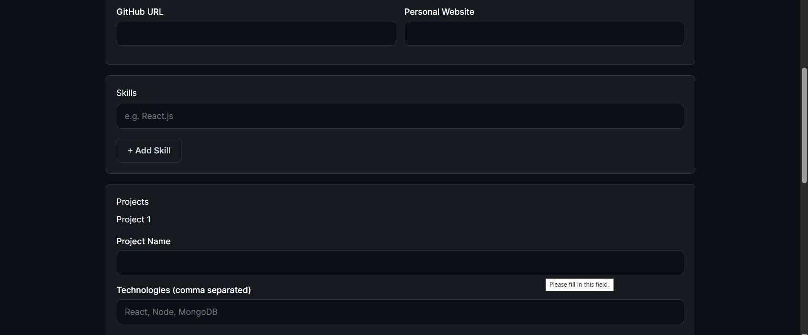
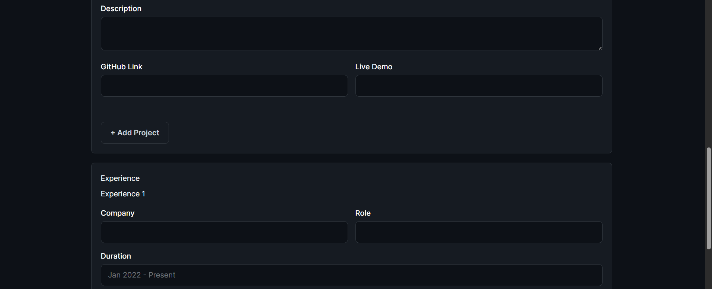
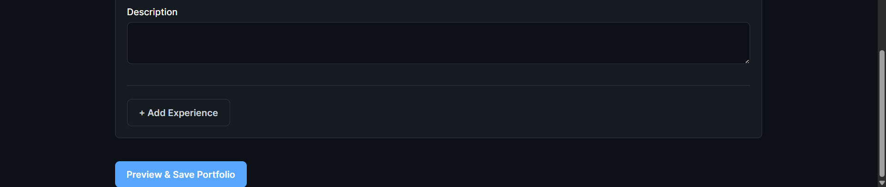
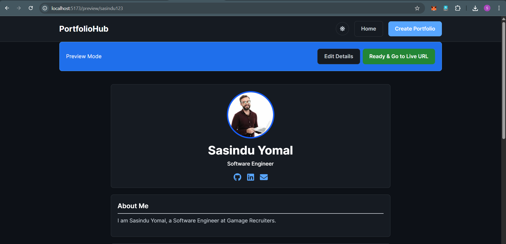
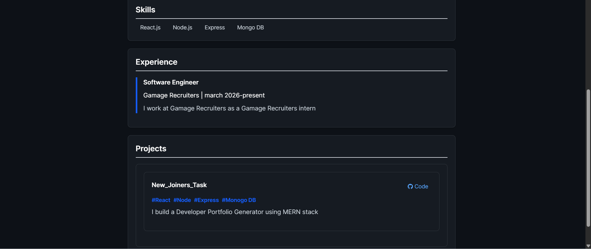
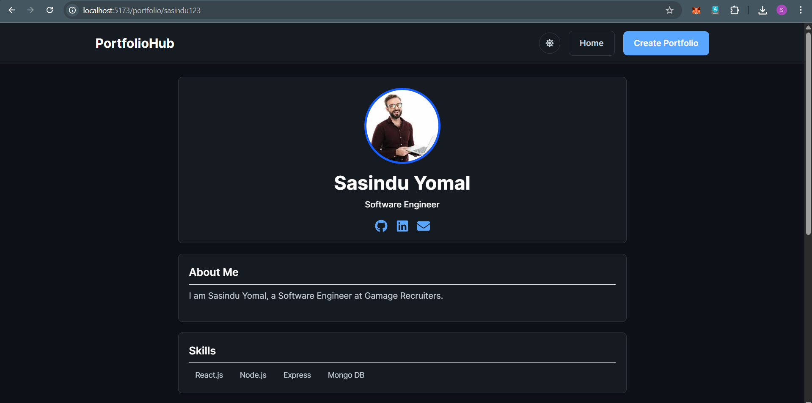
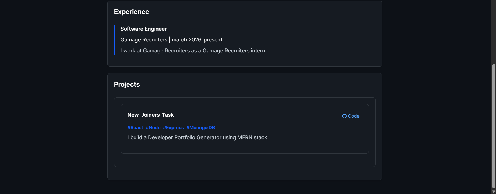

# FolioX — Developer Portfolio Generator

> A full-stack MERN application that lets developers generate beautiful, shareable portfolio pages by filling out a simple form.

---

## Screenshots

| Page | Preview |
|------|---------|
| Home |  |
| Create Portfolio |  |
| Create Portfolio |  |
| Create Portfolio |  |
| Create Portfolio |  |
| Portfolio Preview |  |
| Portfolio Preview |  |
| Public Portfolio |  |
| Public Portfolio |  |

---

## Tech Stack

### Frontend
| Technology | Purpose |
|---|---|
| React.js | UI framework |
| React Router v6 | Client-side routing |
| Axios | HTTP requests |
| Tailwind CSS | Styling |
| React Icons | Icon library |
| Vite | Build tool & dev server |

### Backend
| Technology | Purpose |
|---|---|
| Node.js | Runtime environment |
| Express.js | REST API framework |
| MongoDB | NoSQL database |
| Mongoose | ODM for schema & validation |
| CORS | Cross-origin resource sharing |
| dotenv | Environment variable management |

---

## Project Structure

```
foliox/
├── backend/
│   ├── controllers/
│   │   └── portfolioController.js
│   ├── models/
│   │   └── UserPortfolio.js
│   ├── routes/
│   │   └── portfolioRoutes.js
│   ├── .env
│   ├── package.json
│   └── server.js
│
└── frontend/
    ├── public/
    ├── src/
    │   ├── components/
    │   │   ├── Navbar.jsx
    │   │   ├── PortfolioForm.jsx
    │   │   └── PortfolioTemplate.jsx
    │   ├── pages/
    │   │   ├── Home.jsx
    │   │   ├── CreatePortfolio.jsx
    │   │   ├── EditPortfolio.jsx
    │   │   ├── PortfolioPreview.jsx
    │   │   └── PortfolioPage.jsx
    │   ├── services/
    │   │   └── api.js
    │   └── App.jsx
    ├── index.html
    ├── package.json
    └── vite.config.js
```

---

## Environment Variables

### Backend — `backend/.env`

Create a `.env` file in the `backend/` folder with the following variables:

```env

# For MongoDB Atlas (recommended for deployment):
# MONGO_URI=mongodb+srv://<username>:<password>@cluster.mongodb.net/Portfolio_DB

# Port the backend server runs on
PORT=5000
```

> ⚠️ Never commit your `.env` file. Make sure `.env` is listed in your `.gitignore`.

---

## Setup Instructions

### Prerequisites

Make sure you have the following installed:

- [Node.js](https://nodejs.org/) v18 or higher
- [MongoDB](https://www.mongodb.com/try/download/community) (local) **or** a [MongoDB Atlas](https://www.mongodb.com/atlas) account
- npm v9 or higher

---

### 1. Clone the repository

```bash
git clone https://github.com/your-username/foliox.git
cd foliox
```

---

### 2. Set up the backend

```bash
# Navigate to backend folder
cd backend

# Install dependencies
npm install

# Create the environment file
cp .env.example .env
# Then edit .env and add your MONGO_URI
```

Start the backend server:

```bash
node server.js
```

You should see:
```
Connected to MongoDB
Server is running on port 5000
```

---

### 3. Set up the frontend

Open a **new terminal** and run:

```bash
# Navigate to frontend folder
cd frontend

# Install dependencies
npm install

# Start the Vite dev server
npm run dev
```

The frontend will be available at: **http://localhost:5173**

---

### 4. Vite proxy configuration

Make sure your `vite.config.js` has the proxy set up so frontend API calls are forwarded to the backend:

```js
// frontend/vite.config.js
import { defineConfig } from 'vite';
import react from '@vitejs/plugin-react';

export default defineConfig({
  plugins: [react()],
  server: {
    proxy: {
      '/api': {
        target: 'http://localhost:5000',
        changeOrigin: true,
      },
    },
  },
});
```

---

## API Endpoints

| Method | Endpoint | Description |
|--------|----------|-------------|
| `POST` | `/api/portfolio` | Create a new portfolio |
| `GET` | `/api/portfolio/:username` | Fetch a portfolio by username |
| `PUT` | `/api/portfolio/:username` | Update an existing portfolio |
| `DELETE` | `/api/portfolio/:username` | Delete a portfolio |

---

## Application Routes

| Route | Page | Description |
|-------|------|-------------|
| `/` | Home | Landing page with CTA |
| `/create` | Create Portfolio | Multi-section portfolio form |
| `/preview/:username` | Portfolio Preview | Owner view with edit/delete |
| `/edit/:username` | Edit Portfolio | Pre-filled edit form |
| `/portfolio/:username` | Public Portfolio | Publicly shareable portfolio page |

---

## Database Schema

```js
UserPortfolio {
  username:     String (required, unique),
  fullName:     String (required),
  title:        String,
  bio:          String,
  profileImage: String (URL),
  contact: {
    email:    String,
    linkedin: String,
    github:   String,
    website:  String,
  },
  skills:   [String],
  projects: [{
    name:        String,
    description: String,
    techStack:   [String],
    githubLink:  String,
    liveDemo:    String,
  }],
  experience: [{
    company:     String,
    role:        String,
    duration:    String,
    description: String,
  }],
  timestamps: true
}
```

---

## Running Both Servers Together (optional)

Install `concurrently` to run both servers with a single command:

```bash
# From the project root
npm install -D concurrently

# Add this to your root package.json scripts:
# "dev": "concurrently \"cd backend && node server.js\" \"cd frontend && npm run dev\""

npm run dev
```

---

## Author

Built by Sasindu Yomal as part of the FolioX intern assignment.

- GitHub: https://github.com/SasinduYomal
- LinkedIn: https://www.linkedin.com/in/sasindu-yomal-a42a3a36b
